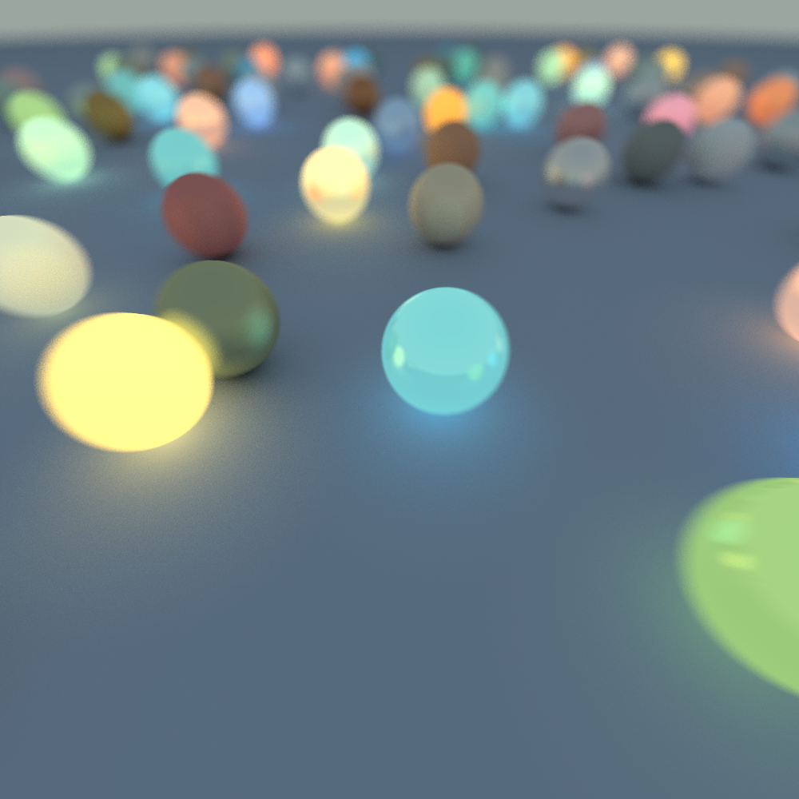
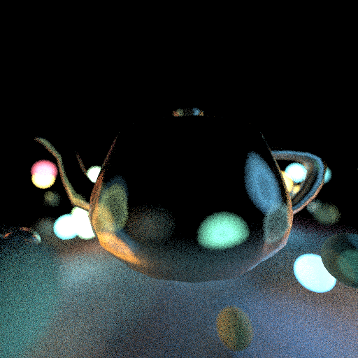

# TermRay
Raytracer written in Rust being displayed on the terminal

## Screenshots
**Note: these images are being exported with the `F12` key, and it's not the original size that it uses when displaying on the terminal.**

